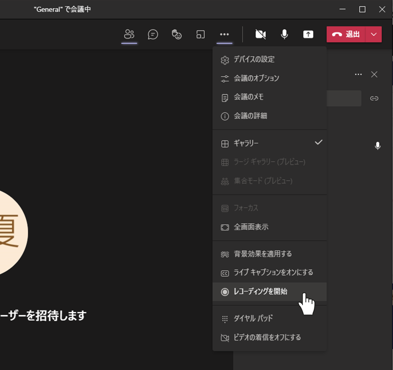
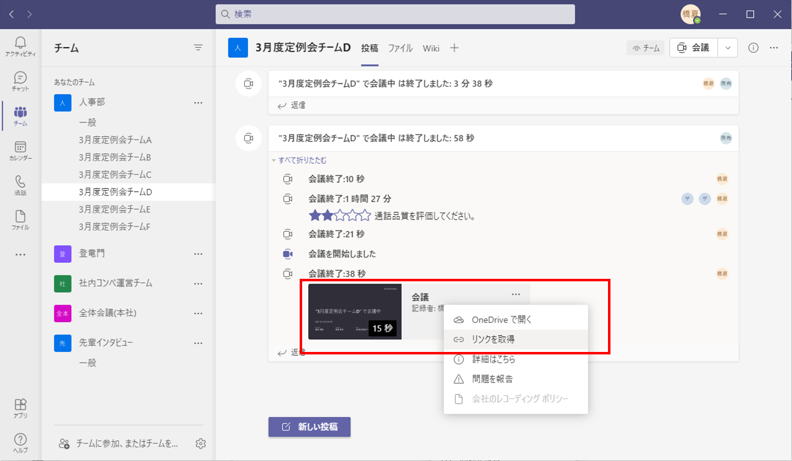

# 進行役の方への事前確認のお願い

定例会ワークについて、チーム内での進行役をお願いした方に1点、事前確認のお願いです。

※事前確認に掛かる時間は 5 分ほどです

## ✅ ①チームの小部屋に入れるか？
以下のチーム分けページにある、ご担当のチームに示してあるリンクをクリックして、Teams 会議に参加できるかご確認ください

チーム分けページ：
https://github.com/fs5013-furi-sutao/fs-monthly-meeting-2021-03

※リンク押下後、Teams を開くのはアプリでもブラウザでも、どちらでもかまいません

## ✅ ② レコーディングボタンを押せるか？
Teams 会議に参加できたら、メニューアイコン中にある三点リーダ―を押して、メニュー項目の中から「レコーディングを開始」ボタンを押してください

成功すれば、3 ～ 4 秒で録画が開始されますので、
再度、メニューから「レコーディングを停止」で録画を停止してください

メニューの「レコーディングを開始」：

## ✅ ③ 動画共有リンクを取得できるか？
その後、会議から「電話マーク」を押して退出し、アプリのホームに録画情報が出ていることを確認してください

こちらの3点リーダーを押して、「リンクを取得」を押すことで録画した動画の共有リンクが取得を確認してください

「リンクを取得」を押して動画共有リンクを取得：

## ⭕ 確認完了です！
以上、① ② ③ がすべて確認 OK であれば、定例会ワークに臨んでいただいて問題ありません

## 🙇 本番の定例会ワーク終了後には 

実際の定例会ワーク後、こちらの方法で、動画共有リンクを取得し、橋本までご連携いただくようお願い致します
